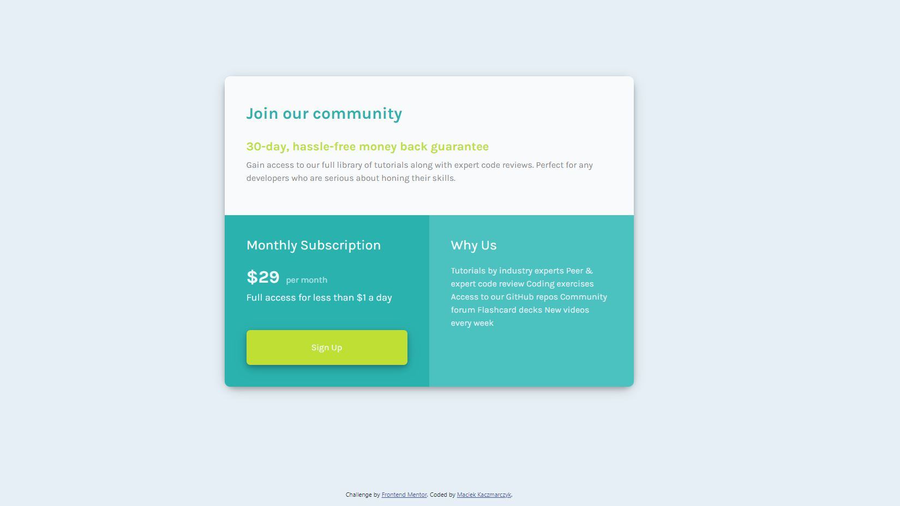

# Frontend Mentor - Single price grid component solution

This is a solution to the [Single price grid component challenge on Frontend Mentor](https://www.frontendmentor.io/challenges/single-price-grid-component-5ce41129d0ff452fec5abbbc). Frontend Mentor challenges help you improve your coding skills by building realistic projects. 

## Table of contents

- [Overview](#overview)
  - [The challenge](#the-challenge)
  - [Links](#links)
  - [Built with](#built-with)
  - [What I learned](#what-i-learned)
  - [Continued development](#continued-development)
- [Author](#author)

## Overview

### The challenge

Users should be able to:

- View the optimal layout for the component depending on their device's screen size
- See a hover state on desktop for the Sign Up call-to-action

### Screenshot

### Links

- Solution URL: [https://www.frontendmentor.io/solutions/responsive-single-price-grid-challange-using-bootstrap-Syy7jAZNq]

- Live Site URL: [https://maciej-kaczmarczyk.github.io/Frontend-Mentor-Single-price-grid-component/]

## My process
- Reading Brief
- Basic HTML coding
- Basic CSS coding
- Learning basics of bootstrap to make page responsive
- Coding responsivnes

### Built with

- HTML
- CSS
- Bootstrap

### What I learned

In this project I learned basics of bootstrap and how to use "@media" in CSS

### Continued development

In my future project I want to master bootstrap, grids and making my websites responsive

## Author

Maciej Kaczmarczyk

